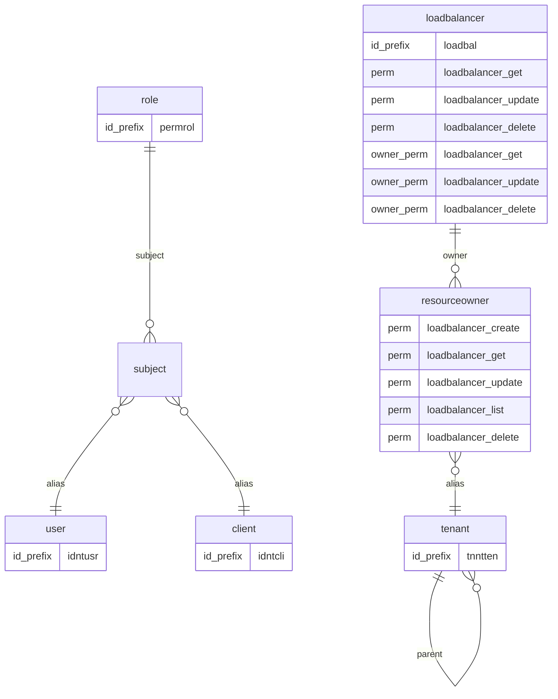

```mermaid
erDiagram
	role {
		id_prefix permrol
	}
	role ||--o{ subject : subject
	user {
		id_prefix idntusr
	}
	client {
		id_prefix idntcli
	}
	tenant {
		id_prefix tnntten
	}
	tenant ||--o{ tenant : parent
	loadbalancer {
		id_prefix loadbal
		perm loadbalancer_get
		perm loadbalancer_update
		perm loadbalancer_delete
		owner_perm loadbalancer_get
		owner_perm loadbalancer_update
		owner_perm loadbalancer_delete
	}
	loadbalancer ||--o{ resourceowner : owner
	subject {
	}
	subject }o--|| user : alias
	subject }o--|| client : alias
	resourceowner {
		perm loadbalancer_create
		perm loadbalancer_get
		perm loadbalancer_update
		perm loadbalancer_list
		perm loadbalancer_delete
	}
	resourceowner }o--|| tenant : alias
```
