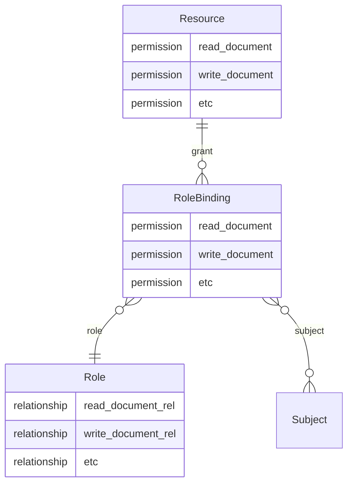
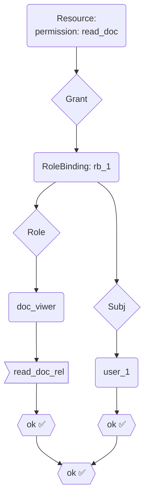
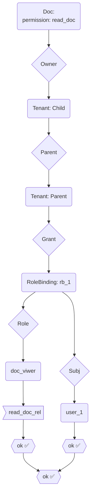
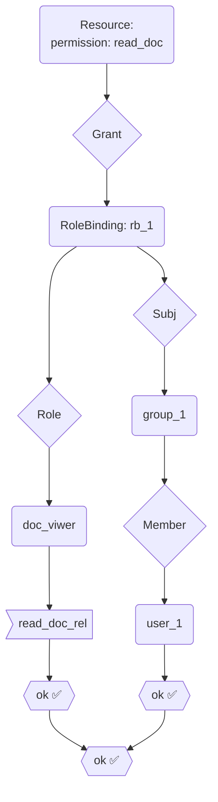

# RBAC V2

## Role-Bindings

The following diagram describes the most basic role-binding relationships:



### RBAC IAPL

In the IAPL, a new `rbac` directive is introduced to define the RBAC configurations.

property | yaml | type | description
-|-|-|-
RoleResource |`rbac.roleresource`| string | name of the resource type that represents a role.
RoleRelationshipSubject |`rbac.rolerelationshipsubject`| string | name of the relationship that connects a role to a subject.
RoleOwners |`rbac.roleowners`| []string | names of the resource types that can own a role.
RoleBindingResource |`rbac.rolebindingresource`| string | name of the resource type that represents a role binding.
RoleBindingSubjects |`rbac.rolebindingsubjects`| []string | names of the resource types that can be subjects in a role binding.
RolebindingPermissionsPrefix |`rbac.rolebindingpermissionsprefix`| string | generates the permissions sets to manage role bindings,
GrantRelationship |`rbac.grantrelationship`| string | name of the relationship that connects a role binding to a resource.  e.g. rolebinding_create, rolebinding_list, rolebinding_delete, etc.

For example, consider the following spicedb schema:

```zed

 definition user {}
 definition client {}

 definition group {
  relation member: user | client
 }

 definition organization {
  relation parent: organization
  relation member: user | client | organization#member
  relation member_role: role | organization#member_role
  relation grant: rolebinding

  permissions rolebinding_list: grant->rolebinding_list
  permissions rolebinding_create: grant->rolebinding_create
  permissions rolebinding_delete: grant->rolebinding_delete
 }

 definition role {
  relation owner: organization
  relation view_organization: user:* | client:*
  relation rolebinding_list_rel: user:* | client:*
  relation rolebinding_create_rel: user:* | client:*
  relation rolebinding_delete_rel: user:* | client:*
 }

 definition role_binding {
  relation role: role
  relation subject: user | group#member
  permission view_organization = subject & role->view_organization
  permissions rolebinding_list: subject & role->rolebinding_list
  permissions rolebinding_create: subject & role->rolebinding_create
  permissions rolebinding_delete: subject & role->rolebinding_delete
 }

```

in IAPL policy terms:

- the RoleResource would be "role"
- the RoleBindingResource would be "role_binding",
- the RoleRelationshipSubject would be `[user, client]`.
- the RoleBindingSubjects would be `[{name: user}, {name: group, subjectrelation: member}]`.
- the RolebindingPermissionsPrefix would be "rolebinding"
- the GrantRelationship would be "grant"

### Roles

A `Role` is a spicedb entity that contains a set of permissions as relationships,
in the form of:

  ```zed
  role:[role_id]#[permission_a]_rel@subject:*
  role:[role_id]#[permission_b]_rel@subject:*
  ```

`subject:*` indicates any subjects [in possession](#bindings) of the role will be granted
those permissions.

### Bindings

A `RoleBinding` establishes a three-way relationship between a role,
a resource, and the subjects, in the form of:

  ```zed
  role_binding:[rb_id]#role@role:[role_id]
  role_binding:[rb_id]#subject@subject:[subject_id]
  resource:[res_id]#grant@role_binding:[rb_id]
  ```

### Permission Lookups

Following is an example of looking up permission `read_doc` for subject `user_1`
on a resource.

Relationships:

1. create role `doc_viewer`

    ```zed
    role:doc_viewer#read_doc_rel@subject:*
    ```

2. create role-binding

    ```zed
    role_binding:rb_1#role@role:doc_viwer
    role_binding:rb_1#subject@subject:user_1
    resource:res_1#grant@role_binding:rb_1
    ```

Lookup:



## Hierarchical Grants

In a lot of permissions scenarios, permission relationships are not as clean-cut
as the example shown above. Most of the times, role-bindings involve binding a role to
subjects on a higher level (e.g., projects, tenant, etc.,) and the users expect
those permissions to be propagated all the resources that it owns. Moreover,
there are cases where, instead of a single user or client being the role-binding
subject, IAM users expect a role can be bind to a group of subjects. The IAPL
is modified to generate a SpiceDB schema to accommodate these more complex
use cases.

### Ownerships

To accommodate inheritance of the grant relationships, a new type of `Condition`
is introduced to the IAPL:

```diff
  type Condition struct {
    RoleBinding        *ConditionRoleBinding
+   RoleBindingV2      *ConditionRoleBindingV2
    RelationshipAction *ConditionRelationshipAction
  }
```

a property of `InheritGrants []string` is defined in `ConditionRoleBindingV2`
that allows the IAPL to generate a permission line in the SpiceDB schema that
allows grants to be inherited from its owner or parent.

For example, consider the following `ActionBinding`:

```yaml
# ...

actionbindings:
  - actionname: read_doc
    typename: doc
    conditions:
      rolebindingv2:
        inheritgrants:
          - owner 
  - actionname: read_doc
    typename: tenant
    conditions:
      rolebindingv2:
        inheritgrants:
          - parent

# ...
```

The IAPL will generate the following SpiceDB schema:

```zed
definition doc {
  relation owner: tenant
  relation grant: role_binding
  permissions read_doc: grant->read_doc + owner->read_doc
}

definition tenant {
  relation parent: tenant
  relation grant: role_binding
  permissions read_doc: grant->read_doc + parent->read_doc
}
```

#### Ownership Example

Consider the following relationships, which is based on the one defined in
[*permissions lookups*](#permission-lookups) section:

```diff
   # create role
   role:doc_viewer#read_doc_rel@subject:*
   
   # grant role doc_viwer to user_1 on tenant parent
   role_binding:rb_1#role@role:doc_viwer
   role_binding:rb_1#subject@subject:user_1
   tenant:parent#grant@role_binding:rb_1

+  # create child tenant
+  tenant:child#parent@tenant:parent
+  # create doc resource
+  doc:doc_1#owner@tenant:child
```

Lookup:



### Memberships

To allowing groups, or any other type of resources with memberships to be the
role-binding subject, all that is needed is to define the membership relationship
in the `rbac.rolebindingsubjects` directive.

For example, consider the following `rbac` directive:

```yaml
rbac:
  rolebindingsubjects:
    - name: user
    - name: group
      subjectrelation: member
```

this will generate the following SpiceDB schema:

```zed
definition role_binding {
  relation role: role
  relation subject: user | group#member
  permission view_doc = subject & role->view_doc
}
```

In this case, the `role_binding` entity can have a `subject` that is either a `user`
or a member of the `group` entity.

Consider the following relationships, which is based on the one defined in
[*permissions lookups*](#permission-lookups) section:

```diff
   # create role
   role:doc_viewer#read_doc_rel@subject:*

+  # create group_1
+  group:group_1#member@user:user_1
   
+  # instead of binding to user_1, bind to group_1
   role_binding:rb_1#role@role:doc_viwer
-  role_binding:rb_1#subject@subject:user_1
+  role_binding:rb_2#subject@subject:group_1#member

   tenant:parent#grant@role_binding:rb_1
```

Lookup:


